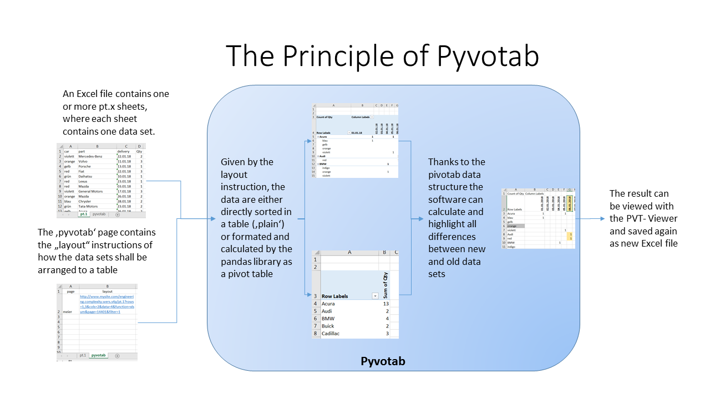

# Pyvotab
Pyvotab is a library and some helping tools to make Excel Worksheets "comparable". When an Excel file is made following the pyvotab design rules or made by one of the pyvotab tools directly, then different versions of this Excel file are comparable, and Pyvotab can either interactively or via command line generate a visual "diff" as new Excel table which shows all differences in a clear and simple representation.



## The Principle of Pyvotab

### Pyvotab does the table layout
Unfortuntely Pyvotab does not consists of such a clever artifical inteligence that it could understand by itself the "sense" of each possible excel table :-)

So the trick works as follows:

To be able to compare tables, pyvotab needs to know their structure of how they've been made up. This structure is called _layout_. So each excel file which can be handled by pyvotab contains one or more layout structure information.

Pyvotab also needs to know which data have been used to fill these layouts.

But when knowing the data itself and how the data has to be layouted to fill the different excel sheet, then pyvotab could do the layout by itself.

So that's how pyvotab works when generating the initial excel files: Pyvotab is supplied with the data itself as one or more simple table structures and with one or more layout instructions of how to layout the data onto different excel sheets. Both input data and layout instructions are stored together with the generated excel sheet in the resulting file

### Do a Comparison
When then Pyvotab compares different versions, it knows the old and old data and the instructions of how to layout them. Then pyvotab first compares the data itself, highlights the differences and layout these marks into the result sheets. 

By that the resulting tables look as before, but they additionally do contain the visual highlighted differences between old and new data.


## Pyvotab as tool to generate complex table layouts

As pyvotab has its build-in layout generator, it can help a lot to bring simple data rows from other input sources into a nice format.

So instead that every data provider need to take care by himself of how to layout the data, he simply can fill an excel file with the necessary input data for pyvotab and then uses the pyvotab command line tools to make proper layouts out of it.

Alternatively he can use the pyvotab software library in his own software to generate final layouted tables directly


Pyvotab reads data provided in a nested array (other formats are possible, but not implemented yet):


```python
t1 = [
	['Hans', 'Mueller', 'Hamburg', 'Postweg', 8],
	['Klaus', 'Meier', 'Hamburg', 'Feldplatz', 5],
	['Klaus', 'Meier', 'Berlin', 'Burgallee', 4],
	['Klaus', 'Schulze', 'Berlin', 'Burgallee', 3],
]
```

and routes that data into an x/y matrix, defined by a layout instruction, referencing to the input data columns:

```python
	//?source=pt.1&page=3&rows=3,4&newname=$&cols=1,2&val=5
```


This is, so far, not very spectacular...


The magic of pyvotab comes in places when not just one single table is loaded, but two or more different revisions of the same data instead.

Pyvotab then overlays all these different tables into one resulting table and clearly marks all data elements if they have been deleted, added or changed.

These markers are fully generic; pyvotab only handle, but do not generate or modify them. So they can be defined e.g. as Excel style object (as the sample program ptViewer does), and the output from pyvotab can be used directly to transform it into e.g. an Excel workbook.

## Usage
Basically the usage of pyvotab consists of 3 steps:

### Initialisation: 

Create a pyvotab object by define the change marker object and the wanted result table layout

    pt = Pyvotab('lightgrey','lightgreen','yellow','lightblue', 'aquamarine', { 'page': 3, 'rows' : [ 3,4 ], 'cols' : [1, 2], 'val' : 5 , 'filter': None, 'pivot': 'plain'})

### Fill with data

Add one or more data set revions to it

    pt.InsertTable( t1, False, "white")
    pt.InsertTable( t2, True, "white")

### Get the Result Table

Pick up the resulting tables and iterate throught it:

    for pyvot_sheet in pt.getPrintDict():

